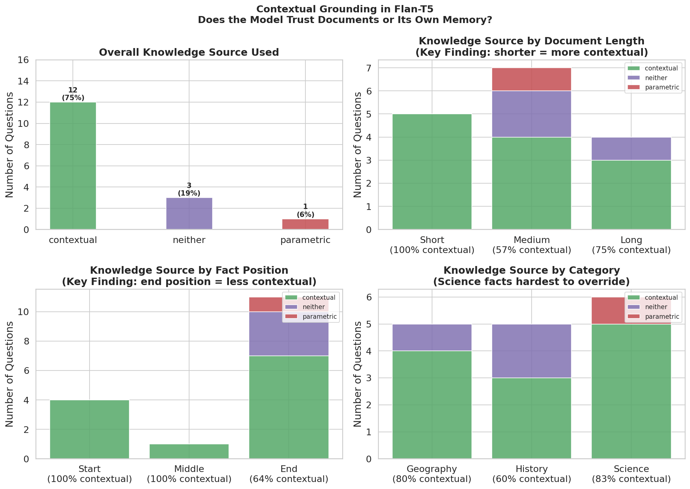

# Do LLMs Trust Documents or Their Own Memory?

**Author:** Krishna Varshini Ilindra  
**Background:** M.S. in Computer Science, University of Bridgeport  
&nbsp;&nbsp;&nbsp;&nbsp;&nbsp;&nbsp;&nbsp;&nbsp;&nbsp;&nbsp;&nbsp;&nbsp;&nbsp;&nbsp;&nbsp;&nbsp;&nbsp;&nbsp;&nbsp;&nbsp;&nbsp;Software Developer  
**Run the notebook:** [Open in Colab](https://colab.research.google.com/drive/141ZqlZ1nzE5xmUqjdTB0HhULQKs59IrY#scrollTo=Qbm3VUM9SjJ1)

---

## Why I Built This

I came across Dr. Ameeta Agrawal's research on contextual grounding 
in large language models — specifically the idea that LLMs don't 
always use the information given to them, and sometimes rely on 
their own training memory instead.

I wanted to try it myself and see if I could reproduce the effect 
with a controlled experiment.

---

## The Experiment

I gave Flan-T5 a series of documents containing deliberately wrong 
facts — then asked questions about those facts.

For example:
- Document says: *"The Eiffel Tower is located in Berlin"*
- Question: *"Where is the Eiffel Tower?"*

If the model answers **"Berlin"** → it trusted the document ✅  
If the model answers **"Paris"** → it ignored the document and 
used its own memory ❌

I tested 16 cases across three variables:
- Document length (short, medium, long)
- Fact position (start, middle, end of document)
- Topic category (geography, science, history)

---

## Results

| Dimension | Finding |
|---|---|
| Overall | 75% contextual, 6% parametric, 19% unclear |
| Short documents | 100% contextual |
| Medium documents | 57% contextual |
| Facts at START | 100% contextual |
| Facts at END | 64% contextual |
| History topics | 60% contextual (lowest) |

---

## Visualization

---

## Key Findings

**Finding 1 — Position matters most.**
When the key fact appeared at the START of the document, the model 
used it 100% of the time. When it appeared at the END, that dropped 
to 64%. This confirms the "Lost-in-the-Later" effect — the model 
pays less attention to information at the end of a document.

**Finding 2 — Medium documents are the most unreliable.**
Short documents produced 100% contextual answers. Surprisingly, 
medium-length documents dropped to 57% — lower than long documents 
(75%). This suggests document length alone doesn't explain context 
ignorance — structure and position matter more.

**Finding 3 — Strongly learned facts resist override.**
The DNA discovery date (1953) was impossible to override — even 
when the document explicitly stated 1800, the model answered 1953. 
This shows that parametric knowledge about well-known scientific 
facts is deeply embedded and hard to correct through context alone.

---

## Why This Matters

In real-world applications — RAG systems, document Q&A, medical 
summarization — we assume the model is reading and using the 
document we give it. These results show that assumption isn't 
always safe, especially when key information appears late in 
the document.

---

## Open Questions

- Does this effect get worse with longer documents (10,000+ tokens)?
- Can prompting strategies (e.g. "pay special attention to the 
  last paragraph") reduce the Lost-in-the-Later effect?
- Does this vary across model sizes — is a larger model 
  more or less likely to override context?

---

## Connection to Prior Work

This experiment replicates and extends findings from:
- Agrawal et al. (2024). Contextual vs Parametric Knowledge 
  in Large Language Models. PortNLP Lab, PSU.

---

## Part of a Series

This is the third project in a series on fairness and reliability 
in NLP:

- [Project 1](https://github.com/krishna-Varshini-Ilindra/sentiment-bias-nlp) 
  — Measuring demographic bias in sentiment models
- [Project 2](https://github.com/krishna-Varshini-Ilindra/bias-mitigation-nlp) 
  — Mitigating gender bias using score calibration
- **Project 3** (this repo) — Contextual grounding in LLMs

---

## How to Run

1. Click **Open in Colab** above
2. Runtime → Change runtime type → **T4 GPU**
3. Run all cells top to bottom

---

## References

- Agrawal et al. (2024). Evaluating Contextual Knowledge in 
  Large Language Models. PortNLP Lab, Portland State University.
- Liu et al. (2023). Lost in the Middle: How Language Models 
  Use Long Contexts. arXiv.
